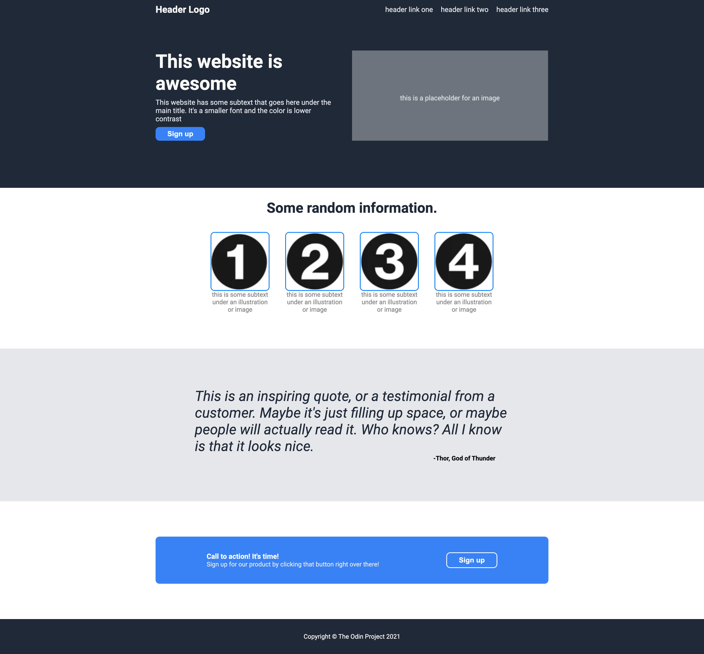

# Odin Landing Page

This project is part of [The Odin Project](https://www.theodinproject.com/) Foundations curriculum.  
It’s a practice exercise in building a simple landing page using **HTML** and **CSS Flexbox**.

---

## 🚀 Live Preview
[View on GitHub Pages](https://j-unisa.github.io/odin-landing-page/)

---

## 📸 Screenshot


---

## 🛠️ Built With
- HTML5  
- CSS3 (Flexbox)

---

## 📂 Getting Started

To view this project locally:

1. Clone the repo
   ```bash
   git clone https://github.com/j-unisa/odin-landing-page.git